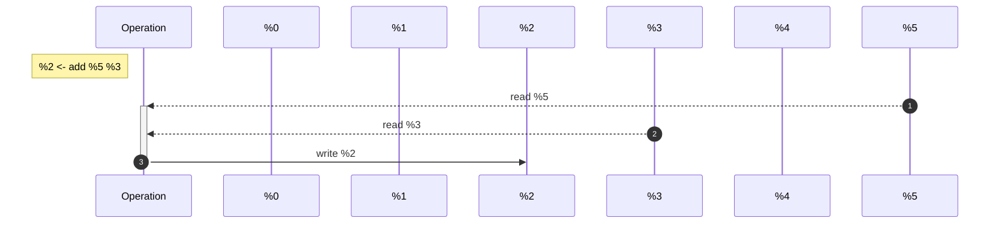
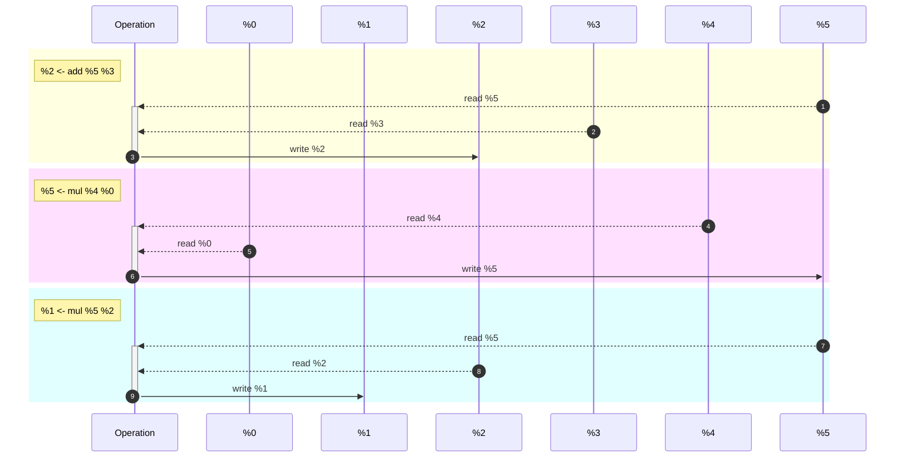

# Roc Optimizable Abstract Representation (ROAR)

> [!WARNING]
> This assumes familiarity with concepts like the stack, registers

Roc Optimizable Abstract Representation (ROAR) is proposed part of the `dev` backend to be between the `mono` stage and the machine instructions ultimately produced by the compiler. Currently, the `dev` backend tends to overuse memory and the stack, when ultimatly, intermediate computations could be stored in registers and not moved into memory. 
For example, the instructions:
```elm
x = 5
y = 3
z = x + y
z = 2 * z
```
might be translated into 
```gas
# .text
mov $5 X_LOC # x = 5
mov $3 Y_LOC # y = 3
mov [X_LOC] %rax # %0 = x
mov [Y_LOC] %rbx # %1 = y
add %rbx %rax # %0 = %0 + %1
mov %rax Z_LOC # Z = %0
mov [Z_LOC] %rax # %0 = Z
mul $2 %rax # %0 = %0 * 2
mov %rax Z_LOC # Z = %0
# ...
# .data
X_LOC: .byte
Y_LOC: .byte
Z_LOC: .byte
```
(Unless otherwise specified, AT&T arguement order is used (destination **last**), and GAS syntax used)
(This example is extremely prelimanry, I didn't check that this is what is actually generated, or even that this is valid assembly)
To instead
```gas
# .text
mov $5 X_LOC # x = 5
mov $3 Y_LOC # y = 3
mov [X_LOC] %rax # %0 = x
mov [Y_LOC] %rbx # %1 = y
add %rbx %rax # %0 = %0 + %1
mul $2 %rax # %0 = %0 * 2
mov %rax Z_LOC # Z = %0
# ...
# .data
X_LOC: .byte
Y_LOC: .byte
Z_LOC: .byte
```

## Outline

### ROAR goals 

ROAR seeks to help make the `dev` backend simpler, faster, and easier to maintain. It does this through the creation of an "abstract representation", where instructions are modeled as abstract components that while having the speed and efficencay of assembly has the easy optimizability and maintailibity of higher level languages. In this section, some more specific goals are noted

#### Abstraction and simplificiation of data modeled in the `dev` backend

ROAR seeks to abstract data away from where it is stored. This is done both for the purpose of making it easier to maintain and allowing optimizations to more easily reason about the data. Related to this is the goal hardware register allocation, where because there will now be a system in charge of maintaining the usage of memory (and registers) registers may now be used safely, increasing performance 

#### Increase runtime speed without decreasing build speed 

ROAR seeks to make a better system that is used more and produces better results, so that even though the results are better than can be reached in equal or less time. This would include also perhaps making compilation multi-threaded  

### Reading this Proposal 

> [!NOTE]
> Some confusion about this proposal might be resolved here! 

A *word*, as used here, is a 64 bit (8 byte) unit of information, as opposed to other word sizes such as 16 and 32 bit (among others). Unless otherwise specified, all values referenced are one word wide, and are unless stated otherwise unsigned 
Here, certain things will be written in a psuedo "ROAR assembly". "ROAR assembly", however, does not exist, and is merely used as a notational convention to represent the values being represented without specifiying an implementation and without taking attetion away from the concepts said. 

### Things not Covered 

There are a number of things that will *not* be covered in this proposal, and are noted here so that ROAR may be structed as to permit these in the future:

- Inlining of function calls 
- Semantic optimizations (that is, optimizations that rather than just dealing with memory also deal with specific instructions for instance [strength reduction](https://en.wikipedia.org/wiki/Strength_reduction))

## ROAR Storage and Values

ROAR instructions consist of three parts, the operation itself, `add`, `sub`, `mov`, among many others, the source operand(s), that is the arguements passed to the function, and the destination operand, where the value is being stored. 
In this manual, if a operation is in the form `D <- Op S [...]`, then `Op` is the operand, `S` (and the rest written `...`) is the source, and `D` is the result operand, so, for instance, `%2 <- add %0 %1` is saying set registers 2 to the sum of registers 1 and 0, there are some operations that don't have source and/or destination operand(s), however these will be explictly noted. 

> [!NOTE]
> Yes, this notation is *not* any conventional assembly. It's use, as will be elaborated, is to highlight the value being changed

### Abstract Registers 

The most important feature of ROAR is the Abstract Register, which are used to:

- Store intermediate values
- Act as variables 
- Act as refrences 
- Pass arguements

Here, they are notated as a percent sign (`%`) followed by some number, corresponding to the register number. As opposed to computer registers, there are an infinite[^1] amount, so, for instance, `%432432` is a register, albiet one that will probably not be used
One very importatnt distinction between computer and ROAR registers, *ROAR registers represent presistent data*. This means, that, for example, even if there are 400 operations in between `x=4` and `x`'s next usage, `x` will still be stored in a register. Why the change? To make it easier to optimize code, because a distinction is not drawn between registers and small pieces of memory, we can decide whether to load something into memory or keep it in the computer registers by what is more efficient 

#### Types

To put it simply, Abstract Registers are completly untyped, one word wide storage spaces. That is to say, there is nothing in a register itself to say whether the bits (written in hex for brevity) `00 00 00 00 00 00 00 3E` represent the charecter `>`, the unsigned number 62, or the signed number +62. It is entierly the job of operations to say whether they are working on signed or unsigned arguements (with unsigned being assumed herein)

### The Null Register

All operations in ROAR must take a destination register. The reasoning behind this is that it makes it easier to optimize if all instructions uniformly modify one thing, and that thing is easily accessible to Roc. However, certain operations either sometimes or always don't produce either in a specific case or always a specific value. For instance, if one wants to compare two integers, you want to set *flags* as if subtraction is happening but not actually produce any value. This is where the null register, here written `_`, comes in. It is used when one wants to either throw out the result of an operation, or the operation dosen't produce anything meaniful in the first place, so, for instance, `_ <- sub %0 %1` could be thought of as `cmp %0 %1`. Apart from just flag-setting instructions, certain instructions should *always* output to the null register, some of them are:

- `ret`
- `jmp` and it's derivatives 
- `store` 

### Structure Registers 

While most things can be represented by Abstract Registers, some things cannot. One of the most important things that cannot be easily modeled by them are structures, those are data that does not fit into a small number of words. To create a structure register, one uses the instruction `%n <- create`, where `%n` stores a "refrence" to the register. Similar to refrences in high-level languages, rather than passing around the structure itself, we just pass a refrence stored in a given register to that structure. In addition, here sometimes `@n` will be used instead of `%n` for registers that store structure refrences for clarity  

There are three main instructions that use refrences to structure registers (apart from create), those being `load`, `store`, and `copy`. These are all just variations on the `mov` instruction, just specified to structs, as a quick list, where `A -> B` means "B being set to A":

- `load` is for `Structure -> Register`
- `store` is for `Register -> Structure`
- `copy` is for `Structure -> Structure`

Note that the forms of load and store are not just `%1 <- load #2 @0` and `_ <- store #2 @0 %1`, but rather `%1 <- load #3 @0 #2` and `_ <- store #3 @0 #2 %1`. `#2` is the offset and these instructions use indirect addressing (note that alignment may not be specified, the offset is always in bytes). All of the times `#n` is written, it is a compile time constant, that is to say, offsets must be specified at compile time. The `copy` operation takes in total 5 arguemnts (although one of these is an unused null register) of the form `_ <- copy #4 @0 #1 @2 #3`. 

Note that all of these instructions take one additional arguement before the structures and their offsets. This is simply the number of bytes to be copied, which must be specified at compile time. Because registers can only hold 8 bytes, for the load and store instructions, the first input arguement cannot be greater than 8

> [!NOTE]
> You may have noticed that the `store` and `copy` don't take a (useful) destination register, why is that? Because destination registers only serve to mark data that is being modified, and in the case of these instructions, the refrences themselves are not being modified, rather what's being modified are the things they are refereing to

### Immediate data 
Immediate data is constant compile time data fed into a function. There are a couple types that are quite simple to model, for instance, integers. However, for complex consants, it is harder to create their representation. For instance, `"hello"`, cannot be represented in a single register. Instead, the abstraction used here is the same used in most systems, where when one inputs the value `"hello"`, this is equivalent to 
1. Creating a structure register 
2. Moving the bytes of `"hello"` into that register 
3. Using a refrence to that register 
Basically, if one specifies an array, or string, it is loaded into memory and a refrence to that memory is passed 

### Floating Point Registers
Floating point numbers tend to be represented diffrently than regular registers in most computers. This is for good reason, as it dosen't really make sense to either use a floating point number as a integer or vice versa, or to operate on either as the other. For that reason, ROAR does have floating point registers, those being notated here as `^0`. However, these are completly seperate from regular registers, so `%0` and `^0` do ***not*** refer to the same thing. 
Most arithmetic funcitons are redefined for floats. In addition, there are three more important instructions, `toInt`, `toFloat`, `toIntReg`, and `toFloatReg`. They are of the form `%0 <- toInt ^0`, `^0 <- toFloat %0`, `%0 <- toIntReg ^0` and `^0 <- toFloatReg %0`, respectivly. The diffrence between `toInt` and `toIntReg` as well as `toFloat` and `toFloatReg` has to do with how they are represented. Because floats follow the [IEEE 754](https://en.wikipedia.org/wiki/IEEE_754) specification, and even few that don't still have this property, if one simply takes the bits of a floating point number and treats them aas a integer, the number will be unrelated.
`toInt` and `toFloat` are both for *conversions* from one type to the other. That is to say, they get the corresponding *value* in the other system. `toIntReg` and `toFloatReg` are *reinterpretations* of the bits in the system, that is to say, it essientally says "treat the bits in this register as the other type, then copy it to this register". Note that `toFloat` then `toInt` should always return the initial value, that is to say, `toInt` rounds down, while `toFloat` rounds up.

## ROAR Instructions 

ROAR instructions were intended to be both 
- Abstract enough to be easily optimzable 
- But concrete enough they could quickly be converted to assembly 

### Function Calls 

ROAR is designed to work with descrete sets of instructions, usually individual functions. To call other functions in ROAR, the `call` instruction is used. The `call` instruction can take a variable number of arguements, but must always take at least one, that being the identifier of the function being called. It may then take one output register to store the return value in and some arguement registers that are then passed to the function. 

Note that functions in ROAR must *always* specify the number of arguements they take and where they should be stored, as well as specifying any of them that must be structural refrences. This is due to the fact that ROAR is intended to be hardware agnostic, and therefore must not specify any specific calling convention. 

All functions return a (potentially useless) value. These are in the function specifed as `ret X`, where X is the value being returned. Returns function similary to those in other languages, no further instructions are executed as control returns to the caller with the value. The value returned with `ret` is simply the output of `call`.

#### Function purity

One very important abstraction in ROAR is that every function is pure (with respect to registers), that is to say, a function only modifies its output (register). Each and every single basic operation in ROAR follows this convention, and furthermore, each funciton must also implement it. This, again, is meant both to preserve purity and abstraction and to allow ROAR to be hardware agnostic, as it is not the job of the functions itself to reset the registers.

This is to say, whenever a function call of the form `%0 <- call someFunc %1 %2 %3` is made, the following things are up to ROAR (and not the function itself) to do:

1. Save all registers that are modified in `someFunc` (for instance, using the stack)
2. Use the calling convention to pass `%1`, `%2`, and `%3` as arguments, and map them to their corresponding arguement registers specified by the metadata for `someFunc`
3. Actually call and and go to the function `someFunc`
4. Read the arguements into their appropiate places 
5. Perform whatever calculation is neccasary to get the result 
6. Place this result in a return location 
7. Return to the site of calling 
8. Store the result in `%0`

All of this is abstracted by the single instruction above. The reason for this is that it the calling conventions for machines differ so much that trying to define a more concrete way to specify calls would be either inefficent or incomplete, and therefore this more abstract choice in this case was chosen.

However, this is *not* to say that functions in ROAR don't have *side effects*, only that these don't alter registers. For instance, functions can modify structure registers pointed to by an arguement, as the arguement itself is unchanged (essientally the diffrence between `mut &T` and `&mut T` in Rust)
ROAR does not specif
The reason for this is to make optimizations simpler. For instance, if we at this example:
```fsharp
%0 <- add %1 %2
%2 <- create 
_  <- store #8 %2 #0 %0
```
If this is a function, we know by only looking at the first three columns (the outputs) what registers are being modified, and thus if used in the caller must be saved. 

#### Calling Conventions 
As said before, ROAR does not have a specific calling convention, and instead the calls are made into concrete machine instructions based on the assembly target. So, for instance, `%0 <- call someFunc %1 %2` might represent a completly diffrent set of instructions[^5] on `x86_64` as opposed to `MIPS`, and yet still diffrent from `RISC`, `AARCH64`, and others. Arguebly, this is the most abstract feature of ROAR, the representation of function calls. 
Another importnat things is that registers are scoped by function, but in practice are often merged. This is to say, if `someFunc` calls `otherFunc`, and both modify `%0`, they are not modifing the same register. However, for the purpose of compile speed, they may be merged into some hardware register, and then when `otherFunc` is called `someFunc` will save the value on the stack and then retrive it after `otherFunc`
### Jump Instructions 

Jump functions (and control flow in general) work the same way they do in most architectures. That is to say, there is one basic jump instruction, `jmp`, that always goes to wherever is specifed by the `jmp` instruction. To get conditional jumping, one simple uses flags, which describe the result of the last operation, a feature almost ubiquitous among machines. Some of the jump forms that might be implemented are:

- `jeq` (jump if equal) and `jnq` (jump if not equal)
- `jge` (jump if greater than or equal to) and `jlt` (jump less than)
- `jle` (jump if less than or equal to) and `jgt` (jump greater than)
- `jo` (jump if overflow) and `jno` (jump if no overflow)
- `jz` (jump if zero) `jnz` (jump if not zero)

Note that jump functions may only jump to instructions in their own code segment. That is to say, jumps cannot occur across functions.

### Important Instructions not mentioned 

Here is a not exhaustive list of functions demmeed worthy of mention that have not yet been mentioned here. Again *not* every function in ROAR will be mentioned in here. As a baseline, all or almost all of the functions defined by the [Backend](https://github.com/roc-lang/roc/blob/main/crates/compiler/gen_dev/src/lib.rs#L307)
#### Bit Functions 
The bit index function are the functions that operate on individual bits inside a register. It has the form `%0 <- bitget %1 %2`, which takes the `%2`th bit in `%1`, then clears `%0` and sets it to the bit in `%2`. To get bit comparsion, just use the null register as the result, so `_ <- bitget %1 %2` (perhaps followed by `jnz`). To *set* a specific bit in a register, use `bitset`, which is of the form `%0 <- bitset %1 %2 %3`, which sets the `%3`th bit of `%0` to the `%2`th bit of `%1`. 
> [!NOTE]
> Not sure if the index ought to be consant 

In addition, logical operations have both a bitwise and arithemitc form.
#### Floating point arithemetic  
While all the basic operations (such as `%0 <- add %1 %2`) have floating point forms (such as `^0 <- floatAdd ^1 ^2`), there are some operations that don't have such either integral or floating point equivalents.

For instance, there are a total of five operations for division, `sdiv`, `srem`, `udiv`, `urem`, and `fdiv`. These are signed integral division, signed integral modulo, unsigned integer division, unsigned integer modulo, and floating point division. 

Furthermore, there are some operations that *only* have either integral or floating point forms. For instance, exponention and logarithms are only implemented for floats, while most non-arithmetical opperations deal only with normal registers, as for both of these cases, working on the other would not make any sense 
#### Sign Conversions and Casts 
All operations act on the by default 64 bit registers. However, there are times where one only wants to access the first $n$ bits of a value. For instance, if printing the first digit of a hexadecimal value, we only care about the first 4 bits. 
In addition, sometimes we want to ensure that 
## Optimizations
One of the fundemental goals of ROAR was to be optimizable, particularly in terms of lifetimes of registers. For instance, if the last read of `%2` in a function comes before the first write of `%3`, then they can be mapped to the same low-level register. In particular, one of the things done for this was that if you had a operation of the form `%a <- func %b %c %d`, you would know that *only* `%a` is being changed, and `%b` `%c` and `%d` are being read.

The key feature of ROAR that enables this are 
1. The abstraction of registers 
2. Each function having one output register
So, in general [^4], from a instruction, we can always derived what is being read and what is being changed. This means that if we want to represent, say, all reads and writes with respect to registers, we can rewrite the operation of something like `%2 <- add %5 %3` as the list of its requirements and effects on registers, namely:
1. `%2` is modified
2. `%5` is read 
3. `%3` is read
4. Nothing else is either read or written 

So we might represent it as:

Getting a bit more complex, say with this
```fsharp
%2 <- add %5 %3
%5 <- mul %4 %0
%1 <- mul %5 %2
```
If we note all the reads and writes:
1. Write to 2, read 5 and 3
2. Write to 5, read 4 and 0
3. Write to 1, read 5 and 2

We might get this representation

# TODO (This document)


[^1]: Not, in practice, actually infinite, instead represented by a integer, mostly likely an unsigned 32 bit integer. However, this *is* more than 4 billion registers, which should be more than enough 
[^2]: Technincally `jmp` and `call` themselves don't alter the registers, but they *do* cause them to be altered
[^3]: Because one major feature of ROAR is all things being assumed to be 64 bits, each of these *must* be aligned to the 8 byte mark, so the above is actually equivalent to `mov [%0+$97*8] %2`
[^4]: Not including structural registers and floating point registers
[^5]: A diffrent set of semantic instructions. Obviously, the actual opcodes and layouts will vary by architecture
