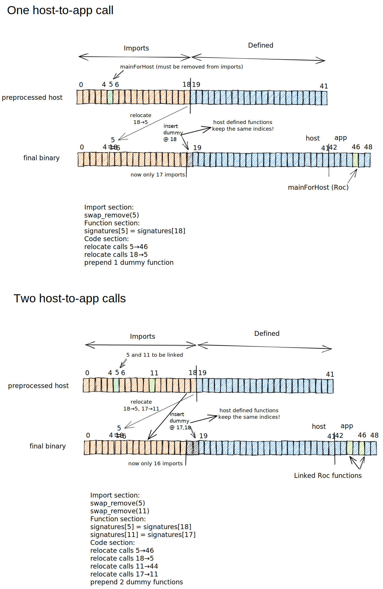

# Development backend for WebAssembly

## Structured control flow

One of the security features of WebAssembly is that it does not allow unrestricted "jumps" to anywhere you like. It does not have an instruction for that. All of the [control instructions][control-inst] can only implement "structured" control flow, and have names like `if`, `loop`, `block` that you'd normally associate with high-level languages. There are branch (`br`) instructions that can jump to labelled blocks within the same function, but the blocks have to be nested in sensible ways.

[control-inst]: https://webassembly.github.io/spec/core/syntax/instructions.html#control-instructions

This way of representing control flow is similar to parts of the Roc AST like `When`, `If` and `LetRec`. But Mono IR converts this to jumps and join points, which are more of a Control Flow Graph than a tree. We need to map back from graph to a tree again in the Wasm backend.

Our solution is to wrap all joinpoint/jump graphs in an outer `loop`, with nested `block`s inside it.

## Stack machine vs register machine

Wasm's instruction set is based on a stack-machine VM. Whereas CPU instructions have named registers that they operate on, Wasm has no named registers at all. The instructions don't contain register names. Instructions can only operate on whatever data is at the top of the stack.

For example the instruction `i64.add` takes two operands. It pops the top two arguments off the VM stack and pushes the result back.

In the [spec][spec-instructions], every instruction has a type signature! This is not something you would see for CPU instructions. The type signature for i64.add is `[i64 i64] → [i64]` because it pushes two i64's and pops an i64.

[spec-instructions]: https://webassembly.github.io/spec/core/appendix/index-instructions.html

This means that WebAssembly has a concept of type checking. When you load a .wasm file as a chunk of bytes into a Wasm runtime (like a browser or [wasmer](https://wasmer.io/)), the runtime will first _validate_ those bytes. They have some fast way of checking whether the types being pushed and popped are consistent. So if you try to do the i64.add instruction when you have floats on the stack, it will fail validation.

Note that the instruction makes no mention of any source or destination registers, because there is no such thing. It just pops two values and pushes one. (This architecture choice helps to keep WebAssembly programs quite compact. There are no extra bytes specifying source and destination registers.)

Implications of the stack machine for Roc:

- There is no such thing as register allocation, since there are no registers! There is no reason to maintain hashmaps of what registers are free or not. And there is no need to do a pass over the IR to find the "last seen" occurrence of a symbol in the IR. That means we don't need the `Backend` methods `scan_ast`, `scan_ast_call`, `set_last_seen`, `last_seen_map`, `free_map`, `free_symbols`, `free_symbol`, `set_free_map`.

- There is no random access to the stack. All instructions operate on the data at the _top_ of the stack. There is no instruction that says "get the value at index 17 in the stack". If such an instruction did exist, it wouldn't be a stack machine. And there is no way to "free up some of the slots in the stack". You have to consume the stuff at the top, then the stuff further down. However Wasm has a concept of local variables, which do allow random access. See below.

## Local variables

WebAssembly functions can have any number of local variables. They are declared at the beginning of the function, along with their types (just like C). WebAssembly has 4 value types: `i32`, `i64`, `f32`, `f64`.

In this backend, each symbol in the Mono IR gets one WebAssembly local. To illustrate, let's translate a simple Roc example to WebAssembly text format.
The WebAssembly code below is completely unoptimised and uses far more locals than necessary. But that does help to illustrate the concept of locals.

```coffee
app "test" provides [main] to "./platform"

main =
    1 + 2 + 4
```

### Direct translation of Mono IR

The Mono IR contains two functions, `Num.add` and `main`, so we generate two corresponding WebAssembly functions.
Since it has a Symbol for every expression, the simplest thing is to create a local for each one.
The code ends up being quite bloated, with lots of `local.set` and `local.get` instructions.

I've added comments on each line to show what is on the stack and in the locals at each point in the program.

```text
  (func (;0;) (param i64 i64) (result i64)   ; declare function index 0 (Num.add) with two i64 parameters and an i64 result
    local.get 0              ; load param 0                                    stack=[param0]
    local.get 1              ; load param 1                                    stack=[param0, param1]
    i64.add                  ; pop two values, add, and push result            stack=[param0 + param1]
    return)                  ; return the value at the top of the stack

  (func (;1;) (result i64)   ; declare function index 1 (main) with no parameters and an i64 result
    (local i64 i64 i64 i64)  ; declare 4 local variables, all with type i64, one for each symbol in the Mono IR
    i64.const 1              ; stack=[1]
    local.set 0              ; stack=[]     local0=1
    i64.const 2              ; stack=[2]    local0=1
    local.set 1              ; stack=[]     local0=1  local1=2
    local.get 0              ; stack=[1]    local0=1  local1=2
    local.get 1              ; stack=[1,2]  local0=1  local1=2
    call 0                   ; stack=[3]    local0=1  local1=2
    local.set 2              ; stack=[]     local0=1  local1=2  local2=3
    i64.const 4              ; stack=[4]    local0=1  local1=2  local2=3
    local.set 3              ; stack=[]     local0=1  local1=2  local2=3  local3=4
    local.get 2              ; stack=[3]    local0=1  local1=2  local2=3  local3=4
    local.get 3              ; stack=[3,4]  local0=1  local1=2  local2=3  local3=4
    call 0                   ; stack=[7]    local0=1  local1=2  local2=3  local3=4
    return)                  ; return the value at the top of the stack
```

### Handwritten equivalent

This code doesn't actually require any locals at all.
(It also doesn't need the `return` instructions, but that's less of a problem.)

```text
  (func (;0;) (param i64 i64) (result i64)
    local.get 0
    local.get 1
    i64.add)
  (func (;1;) (result i64)
    i64.const 1
    i64.const 2
    call 0
    i64.const 4
    call 0)
```

### Reducing sets and gets

For our example code, we don't need any locals because the WebAssembly virtual machine effectively _stores_ intermediate results in a stack. Since it's already storing those values, there is no need for us to create locals. If you compare the two versions, you'll see that the `local.set` and `local.get` instructions have simply been deleted and the other instructions are in the same order.

But sometimes we really do need locals! We may need to use the same symbol twice, or values could end up on the stack in the wrong order and need to be swapped around by setting a local and getting it again.

The hard part is knowing when we need a local, and when we don't. For that, the `WasmBackend` needs to have some understanding of the stack machine.

To help with this, the `CodeBuilder` maintains a vector that represents the stack. For every instruction the backend generates, `CodeBuilder` simulates the right number of pushes and pops for that instruction, so that we always know the state of the VM stack at every point in the program.

When the `WasmBackend` generates code for a `Let` statement, it can "label" the top of the stack with the relevant `Symbol`. Then at any later point in the program, when we need to retrieve a list of symbols in a certain order, we can check whether they already happen to be at the top of the stack in that order (as they were in our example above.)

In practice it should be very common for values to appear on the VM stack in the right order, because in the Mono IR, statements occur in dependency order! We should only generate locals when the dependency graph is a little more complicated, and we actually need them.

```text
  ┌─────────────────┐     ┌─────────────┐
  │                 │     │             │
  │                 ├─────►   Storage   ├──────┐
  │                 │     │             │      │
  │                 │     └─────────────┘      │
  │                 │     Manage state about   │
  │                 │     how/where symbol     │ Delegate part of
  │   WasmBackend   │     values are stored    │ state management
  │                 │                          │ for values on
  │                 │                          │ the VM stack
  │                 │                          │
  │                 │  Generate       ┌────────▼──────┐
  │                 │  instructions   │               │
  │                 ├─────────────────►  CodeBuilder  │
  │                 │                 │               │
  └─────────────────┘                 └───────────────┘
```

## Memory

WebAssembly programs have a "linear memory" for storing data, which is a block of memory assigned to it by the host. You can assign a min and max size to the memory, and the WebAssembly program can request 64kB pages from the host, just like a "normal" program would request pages from the OS. Addresses start at zero and go up to whatever the current size is. Zero is a perfectly normal address like any other, and dereferencing it is not a segfault. But addresses beyond the current memory size are out of bounds and dereferencing them will cause a panic.

The program has full read/write access to the memory and can divide it into whatever sections it wants. Most programs will want to do the traditional split of static memory, stack memory and heap memory.

The WebAssembly module structure includes a data section that will be copied into the linear memory at a specified offset on initialisation, so you can use that for string literals etc. But the division of the rest of memory into "stack" and "heap" areas is not a first-class concept. It is up to the compiler to generate instructions to do whatever it wants with that memory.

## Stack machine vs stack memory

**There are two entirely different meanings of the word "stack" that are relevant to the WebAssembly backend.** It's unfortunate that the word "stack" is so overloaded. I guess it's just a useful data structure. The worst thing is that both of them tend to be referred to as just "the stack"! We need more precise terms.

When we are talking about the instruction set, I'll use the term _machine stack_ or _VM stack_. This is the implicit data structure that WebAssembly instructions operate on. In the examples above, it's where `i64.add` gets its arguments and stores its result. I think of it as an abstraction over CPU registers, that WebAssembly uses in order to be portable and compact.

When we are talking about how we store values in _memory_, I'll use the term _stack memory_ rather than just "the stack". It feels clunky but it's the best I can think of.

Of course our program can use another area of memory as a heap as well. WebAssembly doesn't mind how you divide up your memory. It just gives you some memory and some instructions for loading and storing.

## Calling conventions & stack memory

In WebAssembly you call a function by pushing arguments to the stack and then issuing a `call` instruction, which specifies a function index. The VM knows how many values to pop off the stack by examining the _type_ of the function. In our example earlier, `Num.add` had the type `[i64 i64] → [i64]` so it expects to find two i64's on the stack and pushes one i64 back as the result. Remember, the runtime engine will validate the module before running it, and if your generated code is trying to call a function at a point in the program where the wrong value types are on the stack, it will fail validation.

Function arguments are restricted to the four value types, `i32`, `i64`, `f32` and `f64`. If those are all we need, then there is _no need for any stack memory_, stack pointer, etc. We saw this in our example earlier. We just said `call 0`. We didn't need any instructions to create a stack frame with a return address, and there was no "jump" instruction. Essentially, WebAssembly has a first-class concept of function calls, so you don't build it up from lower-level primitives. You could think of this as an abstraction over calling conventions.

That's all great for primitive values but what happens when we want to pass more complex data structures between functions?

Well, remember, "stack memory" is not a special kind of memory in WebAssembly, and is separate from the VM stack. It's just an area of our memory where we implement a stack data structure. But there are some conventions that it makes sense to follow so that we can easily link to Wasm code generated from Zig or other languages.

### Observations from compiled C code

- `global 0` is used as the stack pointer, and its value is normally copied to a `local` as well (presumably because locals tend to be assigned to CPU registers)
- Stack memory grows downwards
- If a C function returns a struct, the compiled WebAssembly function has no return value, but instead has an extra _argument_. The argument is an `i32` pointer to space allocated in the caller's stack, that the called function can write to.
- There is no maximum number of arguments for a WebAssembly function, and arguments are not passed via _stack memory_. This makes sense because the _VM stack_ has no size limit. It's like having a CPU with an unlimited number of registers.
- Stack memory is only used for allocating local variables, not for passing arguments. And it's only used for values that cannot be stored in one of WebAssembly's primitive values (`i32`, `i64`, `f32`, `f64`).

These observations are based on experiments compiling C to WebAssembly via the Emscripten toolchain (which is built on top of clang). It's also in line with what the WebAssembly project describes [here](https://github.com/WebAssembly/design/blob/main/Rationale.md#locals).

## Modules vs Instances

What's the difference between a Module and an Instance in WebAssembly?

Well, if I compare it to running a program on Linux, it's like the difference between an ELF binary and the executable image in memory that you get when you _load_ that ELF file. The ELF file is essentially a _specification_ for how to create the executable image. In order to start executing the program, the OS has to actually allocate a stack and a heap, and load the text and data. If you run multiple copies of the same program, they will each have their own memory and their own execution state. (More detail [here](https://wiki.osdev.org/ELF#Loading_ELF_Binaries)).

The Module is like the ELF file, and the Instance is like the executable image.

The Module is a _specification_ for how to create an Instance of the program. The Module says how much memory the program needs, but the Instance actually _contains_ that memory. In order to run the Wasm program, the VM needs to create an instance, allocate some memory for it, and copy the data section into that memory. If you run many copies of the same Wasm program, you will have one Module but many Instances. Each instance will have its own separate area of memory, and its own execution state.

## Modules, object files, and linking

A WebAssembly module is equivalent to an executable file. It doesn't normally need relocations since at the WebAssembly layer, there is no Address Space Layout Randomisation. If it has relocations then it's an object file.

The [official spec](https://webassembly.github.io/spec/core/binary/modules.html#sections) lists the sections that are part of the final module. It doesn't mention any sections for relocations or symbol names, but it does support "custom" sections. Conventions to use those for linking are documented in the WebAssembly `tool-conventions` repo [here](https://github.com/WebAssembly/tool-conventions/blob/main/Linking.md) and it mentions that LLVM is using those conventions.

## Linking host-to-app calls

We implement a few linking operations in the Wasm backend. The most important are host-to-app calls.

In the host .wasm file, `roc__main_for_host_1_exposed` is defined as a Wasm Import, as if it were an external JavaScript function. But when we link the host and app, we need to make it an internal function instead.

There are a few important facts to note about the Wasm binary format:

- Function calls refer to the callee by its function index in the file.
- If we move a function from one index to another, all of its call sites need to be updated. So we want to minimise this to make linking fast.
- If we _remove_ a function, then all functions above it will implicitly have their indices shifted down by 1! This is not good for speed. We should try to _swap_ rather than remove.
- JavaScript imports always get the lower indices.

With that background, here are the linking steps for a single app function that gets called by the host:

- Remove `roc__main_for_host_1_exposed` from the imports, updating all call sites to the new index, which is somewhere in the app.
- Swap the _last_ JavaScript import into the slot where `roc__main_for_host_1_exposed` was, updating all of its call sites in the host.
- Insert an internally-defined dummy function at the index where the last JavaScript import used to be.

The diagram below illustrates this process.

> The diagram has a tiny number of functions just to make it easier to draw! Our mock host for integration tests has 48 imports and 648 defined functions.

&nbsp;



## Tips for debugging Wasm code generation

In general, WebAssembly runtimes often have terrible error messages. Especially command-line ones. And most especially Wasm3, which we use nonetheless because it's fast.

- Install the WABT (WebAssembly Binary Toolkit)
  - We have a debug setting to dump out the test binary. In `gen_wasm/src/lib.rs`, set `DEBUG_LOG_SETTINGS.keep_test_binary` to `true`
  - Run `wasm-validate` to make sure the module is valid WebAssembly
  - Use `wasm-objdump` with options `-d`, `-x`, or `-s` depending on the issue
- Browsers are **much** better for debugging Wasm than any of the command line tools.
  - I highly recommend this, even if you are more comfortable with the command line than the browser!
  - Browsers have by far the best error messages and debugging tools. There is nothing comparable on the command line.
  - We have a web page that can run gen_wasm unit tests:
      crates/compiler/test_gen/src/helpers/debug-wasm-test.html
  - The page itself contains instructions explaining how to open the browser debug tools. No web dev background should be required. If there's something useful missing, let Brian Carroll know or add him as a reviewer on a PR.
