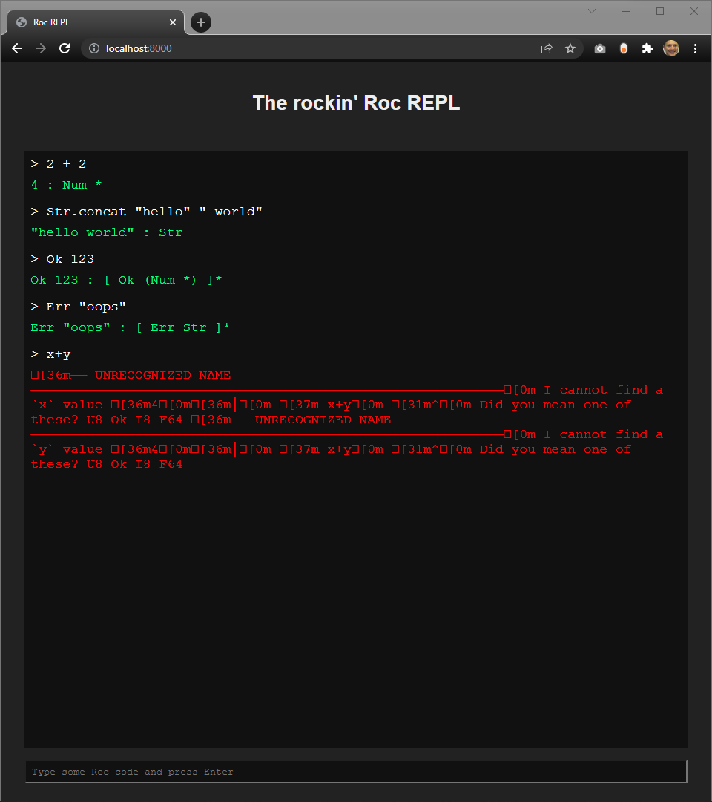
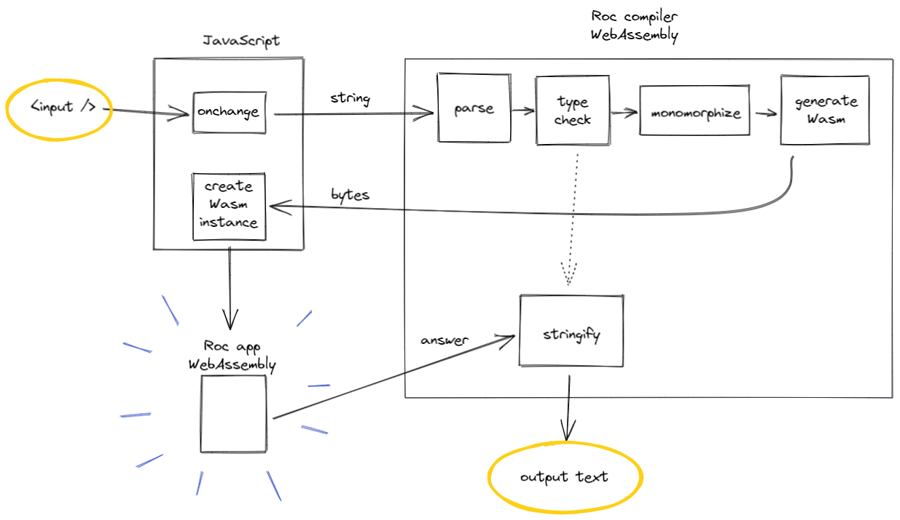

# Web REPL

## Running locally

### 1. Build the Roc website

For a minimal build (when just working on the web REPL)

```bash
cp -r www/public www/build
```

Or, for a full build (with std lib documentation, downloadable source code, etc.)

```bash
www/build.sh
```

### 2. Build the web REPL

This builds the compiler as a `.wasm` file, and generates JS glue code.
It will `cargo install` the `wasm-pack` command line tool if you don't already have it.
You should run it from the project root directory.

```bash
crates/repl_wasm/build-www.sh
cp crates/repl_wasm/build/* www/build/repl/
```

### 2. Run a local HTTP server

Browsers won't load .wasm files over the `file://` protocol, so you need to serve the files in `./www/build/` from a local web server.
Any server will do, but this example should work on any system that has Python 3 installed:

```bash
cd www/build
python3 -m http.server
```

### 3. Open your browser

You should be able to find the Roc REPL at <http://127.0.0.1:8000/repl> (or whatever port your web server mentioned when it started up.)

**Warning:** This is work in progress! Not all language features are implemented yet, error messages don't look nice yet, up/down arrows don't work for history, etc.



## How it works

- User types text into the HTML `<input />` tag
- JS detects the `onchange` event and passes the input text to the Roc compiler WebAssembly module
- Roc compiler WebAssembly module
  - Parses the text (currently just a single line)
  - Type checks
  - Monomorphizes
  - Generates WebAssembly using the development backend (not LLVM)
  - Returns a slice of bytes to JavaScript
- JavaScript
  - Takes the slice of bytes and creates a `WebAssembly.Instance`
  - Runs the WebAssembly app
  - Gets the memory address of the result and makes a copy of the app's entire memory buffer
  - Passes the result address and the memory buffer to the compiler for analysis
- Roc compiler WebAssembly module
  - Analyses the bytes of the result, based on the known return type from earlier
  - Traverses the copied memory buffer to find any child values
  - Produces a user-friendly String and passes it to JavaScript
- JavaScript
  - Displays the input and output text on the web page



## Related crates

There are several directories/packages involved here:

- `www/public/repl/index.html`: The web page with its JavaScript and a build script
- `crates/repl_wasm`: The Rust crate that becomes the "compiler" WebAssembly module
- `crates/repl_eval`: REPL logic shared between `crates/repl_cli` and `crates/repl_wasm`
