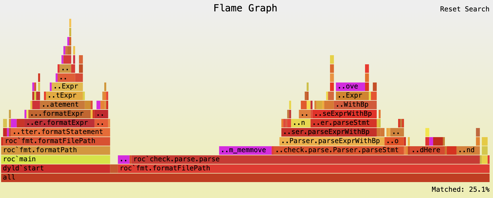
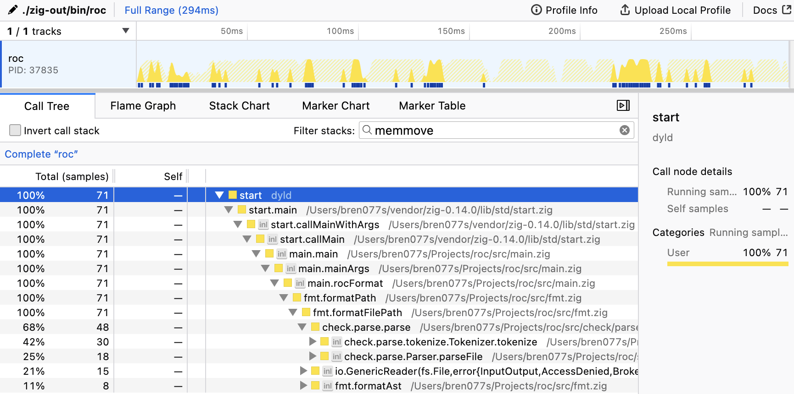
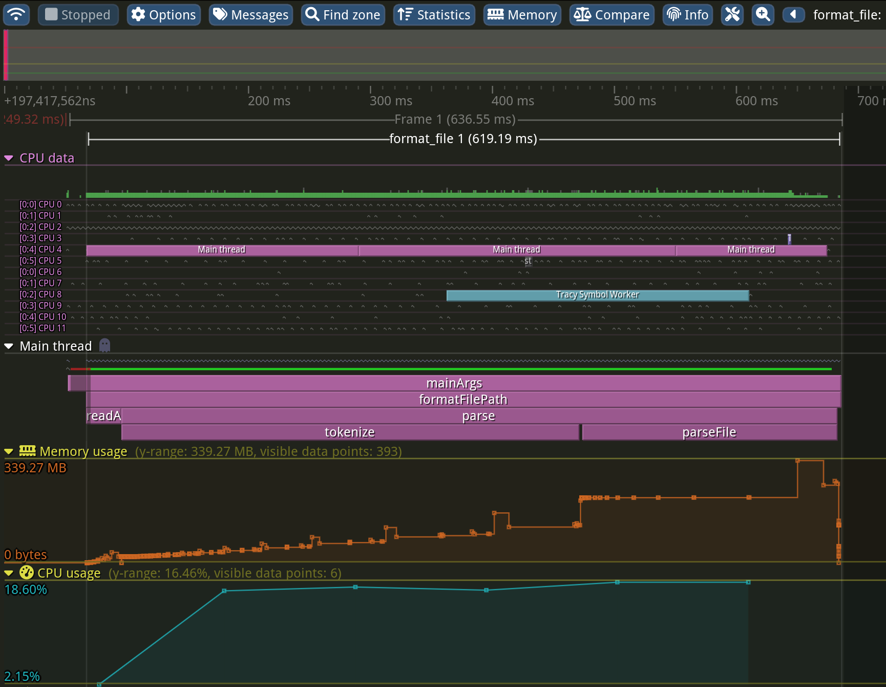

# Profiling Roc

Profiling is a very big topic with many facets and pitfalls.
This is just a preliminary doc to recommend some nice tools and basic flows.

If you have any question, please reach out [on zullip](https://roc.zulipchat.com/).
Feel free to at [Brendan Hansknecht](https://roc.zulipchat.com/#user/343810) in the discussion thread.

## General Tips

1. Make sure to build with optimizations (`-Doptimize=ReleaseFast`).
2. Try to benchmark real world rather than synthetic inputs.
3. Prefer end to end benchmarks when possible.
Microbenchmarks can be misleading and even potentially lead to end to end slowdowns.
4. Probably use linux (linux just gives a lot more info and tools in general).
That said, mac and windows can also be ok.
5. Make sure you have a long enough execution horizon to get good results (sometimes requires looping over the same work multiple times).


## Some Nice Tools

These are tools I recommend for profiling that help get a solid picture.

### [Flamegraph](https://github.com/flamegraph-rs/flamegraph)

Flamegraphs are the core of basic profiling.
They enable quickly finding hotspots in execution.
By regularly sampling callstacks, flamegraphs are able to identify where time is being spent.
This tool simply generates an `svg` to view.

This is a great place to start if new to profiling, but has a number of limitations.
For examples, flamegraphs simply aggregate information with sampling and can miss a lot of data.
They also lack interactivity and many low level details.
Flamegraphs are essentially a still frame view into an apps performance.

The tool is simple to run.
Using it with roc can be as simple as `flamegraph --root -- ./zig-out/bin/roc format /tmp/app.roc`.

> Note: `--root` is not always needed, but it generally gives better results.

If you open the flamegraph in a browser, you can explore where time is spent.
There is a search button in the top right corner (almost not visible) that enables better discovery of percentage of time used in various functions.
For example, here is a flamegraph from parsing and formating a roc file.
It was search for `memmove` and shows that 25% of time is spent moving bytes.



### [Samply](https://github.com/mstange/samply)

Samply is a sampling profiler that that uses the [Firefox profiler](https://profiler.firefox.com/) to give richer info and interactivity on top of a flamegraph.
I find it to be a richer and nicer default than simple flamegraphs, but it is also more complex.
Not only do you get a flamegraph, but you get callstacks, can collapse recursive nodes, and are able to view source lines and assembly hit by the sampler.

Using samply is also super simply, just `samply record -- ./zig-out/bin/roc format /tmp/new.roc`.

Here is an example output after searching for `memmove`.
We can see in the top graph, all the specific times during execution that memmove was using the cpu.
On top of that, we can see that 42% of `memmove`s happened during tokenization.



### [Tracy](https://github.com/wolfpld/tracy)

Unlike the above, tracy is not primarily a sampling profiler.
Instead, tracy focuses on tracing through explicit code annotations.
Tracy is significantly more complex than the other solutions, but is alway way more powerful.
Tracy has an [~100 page detailed manual](https://github.com/wolfpld/tracy/releases/latest/download/tracy.pdf) and an online interactive demo: https://tracy.nereid.pl/.
The most important part of the manual to read is probably `Analyzing captured data` (which is about the UI).

Simply using tracy is more work than the other tools.
Beyond having tracy install, you also need to download the source of tracy checked out to the same version.
For example, I installed tracy with homebrew. It is at version `0.11.0`.
As such, I have checked out the tracy github repro to the `v0.11.0` tag in my `~/vendor/tracy` directory. 

Then, on my linux machine (which tracy works better on), I run ` zig build -Doptimize=ReleaseFast -Dtracy=$HOME/vendor/tracy roc`.
This builds tracy with all of the bells and whistles.
One of those cool features is tracy callstacks. This feature gives much more precision of information, but adds signifcant overhead.
Often times, it is worth profiling once with `-Dtracy-callstack=false` to have much less overhead.

Now that I have the compiler built with tracy, I can launch the tracy server on my mac machine to record the result (you can also run it on the same machine if wanted).
Run `tracy-profiler`, input the correct ip address, and press connect.
Then run the instrumented version of zig: `./zig-out/bin/roc format /tmp/new.roc`.
Also, run with the root user to capture more information.
In this case, I ran:
```
sudo ./zig-out/bin/roc format /tmp/new.roc
```

After that, welcome to a wealth of information:
 - Everything running on the cpu over the course of the execution
 - Zone info and statistics
 - Source information with disassemblies
 - Memory allocations and frees.
 - Locks and multithread info (once the zig roc compiler uses them)

At some point, hopefully we will have videos on using tracy with roc.
Until then, here is [a video on tracy from cppcon](https://youtu.be/ghXk3Bk5F2U?si=BB6sA_s8y5myweRD) and here is an example output.


