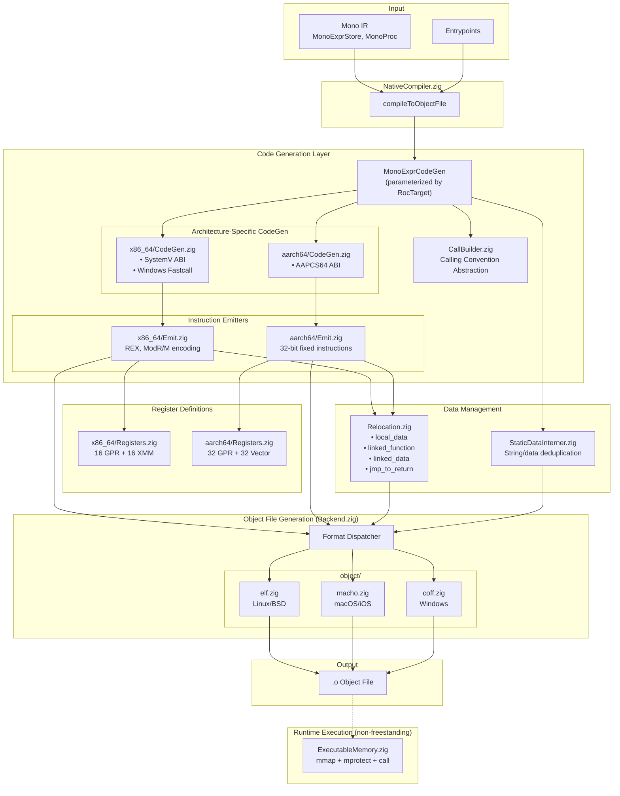

```mermaid
flowchart TB
      subgraph Input
          MonoIR["Mono IR<br/>MonoExprStore, MonoProc"]
          Entrypoints[Entrypoints]
      end

      subgraph NativeCompiler["NativeCompiler.zig"]
          Compile[compileToObjectFile]
      end

      subgraph CodeGenLayer["Code Generation Layer"]
          MonoExprCodeGen["MonoExprCodeGen<br/>(parameterized by RocTarget)"]

          subgraph ArchCodeGen["Architecture-Specific CodeGen"]
              x86CG["x86_64/CodeGen.zig<br/>• SystemV ABI<br/>• Windows Fastcall"]
              armCG["aarch64/CodeGen.zig<br/>• AAPCS64 ABI"]
          end

          subgraph Emitters["Instruction Emitters"]
              x86Emit["x86_64/Emit.zig<br/>REX, ModR/M encoding"]
              armEmit["aarch64/Emit.zig<br/>32-bit fixed instructions"]
          end

          CallBuilder["CallBuilder.zig<br/>Calling Convention Abstraction"]
      end

      subgraph Registers["Register Definitions"]
          x86Regs["x86_64/Registers.zig<br/>16 GPR + 16 XMM"]
          armRegs["aarch64/Registers.zig<br/>32 GPR + 32 Vector"]
      end

      subgraph DataMgmt["Data Management"]
          StaticData["StaticDataInterner.zig<br/>String/data deduplication"]
          Relocs["Relocation.zig<br/>• local_data<br/>• linked_function<br/>• linked_data<br/>• jmp_to_return"]
      end

      subgraph ObjectGen["Object File Generation (Backend.zig)"]
          Dispatcher["Format Dispatcher"]

          subgraph Writers["object/"]
              ELF["elf.zig<br/>Linux/BSD"]
              MachO["macho.zig<br/>macOS/iOS"]
              COFF["coff.zig<br/>Windows"]
          end
      end

      subgraph Output
          ObjFile[".o Object File"]
      end

      subgraph Runtime["Runtime Execution (non-freestanding)"]
          ExecMem["ExecutableMemory.zig<br/>mmap + mprotect + call"]
      end

      MonoIR --> Compile
      Entrypoints --> Compile
      Compile --> MonoExprCodeGen

      MonoExprCodeGen --> x86CG
      MonoExprCodeGen --> armCG
      MonoExprCodeGen --> CallBuilder

      x86CG --> x86Emit
      armCG --> armEmit

      x86Emit --> x86Regs
      armEmit --> armRegs

      x86Emit --> Relocs
      armEmit --> Relocs

      MonoExprCodeGen --> StaticData

      x86Emit --> Dispatcher
      armEmit --> Dispatcher
      Relocs --> Dispatcher
      StaticData --> Dispatcher

      Dispatcher --> ELF
      Dispatcher --> MachO
      Dispatcher --> COFF

      ELF --> ObjFile
      MachO --> ObjFile
      COFF --> ObjFile

      ObjFile -.-> ExecMem
```
